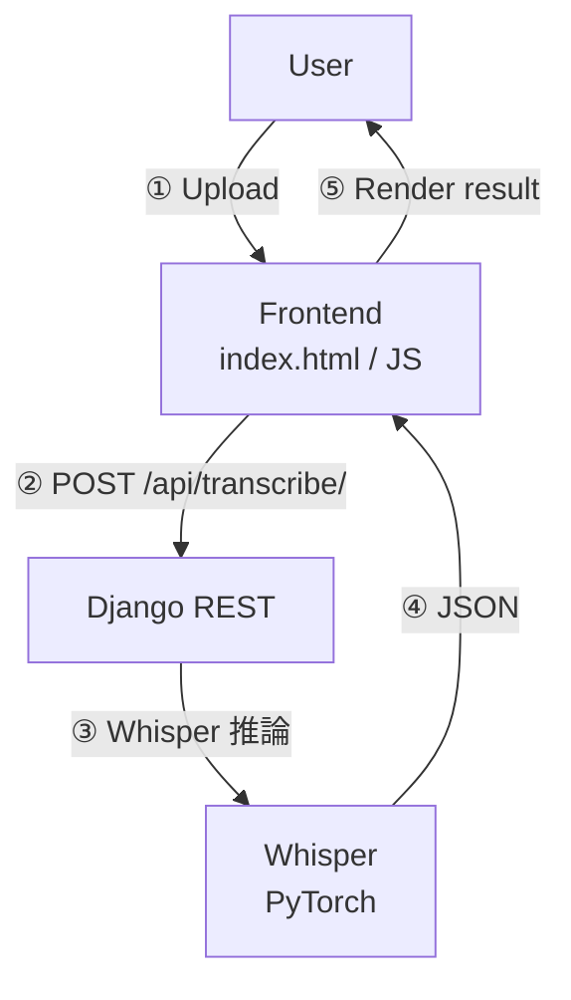

# whisper-web-app

> **Django × OpenAI Whisper** で作るブラウザ文字起こしアプリ  
> Upload → Transcribe → Download をワンストップで。


---

## Table of Contents

1. [概要](#概要)
2. [主な機能](#主な機能)
3. [スクリーンショット / デモ](#スクリーンショット--デモ)
4. [アーキテクチャ](#アーキテクチャ)
5. [動作要件](#動作要件)
6. [セットアップ](#セットアップ)
7. [使い方](#使い方)
8. [ディレクトリ構成](#ディレクトリ構成)
9. [よくある質問](#よくある質問)
10. [開発ロードマップ](#開発ロードマップ)
11. [参考リンク](#参考リンク)
12. [ライセンス](#ライセンス)

---

## 概要

`whisper-web-app` は、Web ブラウザから音声／動画ファイルをアップロードするだけで  
**高精度な文字起こし** を返す Django 製アプリケーションです。  
バックエンドには OpenAI Whisper を採用し、日本語を含む多言語の音声認識に対応しています。

---

## 主な機能

| 機能             | 説明                                         |
|------------------|----------------------------------------------|
| ファイルアップロード | mp3 / wav / mp4 など主要フォーマット対応         |
| 自動文字起こし     | Whisper tiny / base / small などモデル選択可（※1）|
| 進捗表示         | WebSocket (Django Channels) でリアルタイム更新（※2）|
| 結果ダウンロード   | `.txt` または `.srt` 形式で保存                |
| 日本語 UI        | メニュー・エラーメッセージを日本語化            |

※1 モデル選択UIは今後実装予定（現状はbase固定）  
※2 進捗表示は未実装（今後対応予定）

---

## スクリーンショット / デモ

| アップロード画面         | 文字起こし結果         |
|:-----------------------:|:---------------------:|
|  |  |

> フルデモ GIF は [docs/demo.gif](docs/demo.gif) を参照。

---

## アーキテクチャ



- ユーザーが音声ファイルをアップロードし、Whisperで文字起こし、結果を返す一連の流れを示しています。

---

## 動作要件

| ソフト   | バージョン         |
|----------|-------------------|
| Python   | 3.10+             |
| ffmpeg   | 4.4+              |
| CUDA     | 11.8+ (GPU時のみ) |

---

## セットアップ

```bash
git clone https://github.com/haruki0619/whisper-web-app.git
cd whisper-web-app

# Python 仮想環境
# (Linux/Mac)
python -m venv venv
source venv/bin/activate
# (Windows)
venv\Scripts\activate

pip install -r requirements.txt

# マイグレーション
python manage.py migrate

# 開発サーバー起動
python manage.py runserver
```

> GPU を使う場合は pip install torch の CUDA 対応版を入れてください。

---

## 使い方

1. ブラウザで http://127.0.0.1:8000/ を開く
2. 音声／動画ファイルを選択 → 「Transcribe」
3. 文字起こしが完了するとテキストが表示
4. 「Download」から .txt / .srt を保存

---

## ディレクトリ構成

```bash
whisper-web-app/
├── config/               # Django 設定
├── whisper_app/          # フロント (templates/static)
├── transcription/        # REST API & Whisper 呼び出し
├── media/                # アップロードファイル (一時)
├── docs/                 # スクリーンショット / GIF
└── requirements.txt
```

---

## よくある質問

<details>
<summary>Q. GPU がないと動きませんか？</summary>
A. Tiny / Base モデルなら CPU でも動作しますが、処理時間は音声長の 10 倍前後になります。実用速度には GPU を推奨します。
</details>

<details>
<summary>Q. 無料ホスティングにデプロイできますか？</summary>
A. Whisper のモデルサイズが最小でも 1GB 以上あるため、現状の無料プラン（256〜512MB）ではロード時にメモリ不足になります。RunPod など共有 GPU をご検討ください。
</details>

---

## 開発ロードマップ

- フロントを React + Vite 化
- Whisper.cpp 対応（CPU 高速化）
- タイムスタンプ付き字幕 (.vtt) 出力
- Docker / Helm チャート提供

---

## ライセンス

MIT License © 2025 haruki0619

---

## 参考リンク

- [Qiita: 完全無料文字起こしサービスを作りたかった (解説記事)](https://qiita.com/haruki06619/items/c335b3c3550542e63d52)