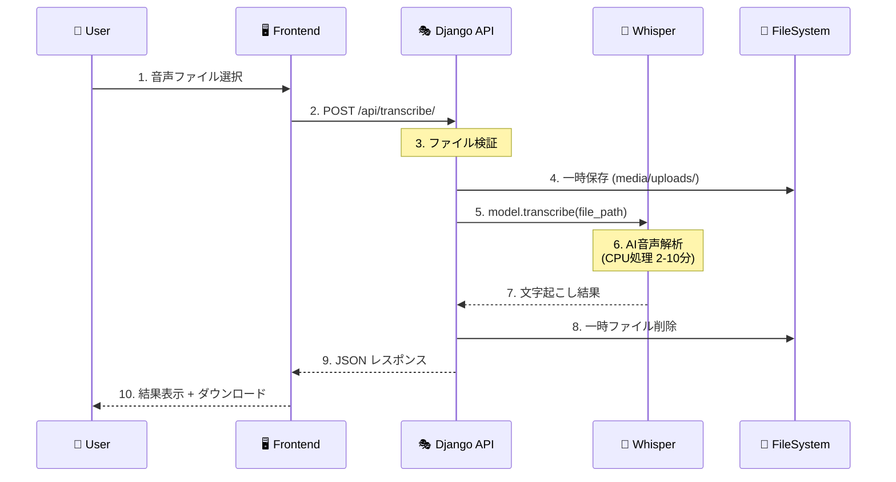
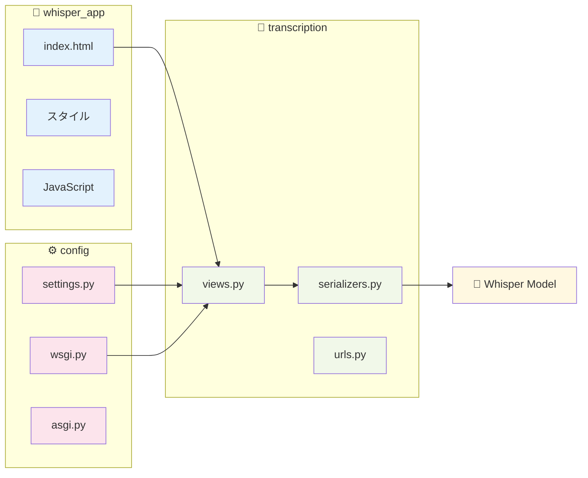
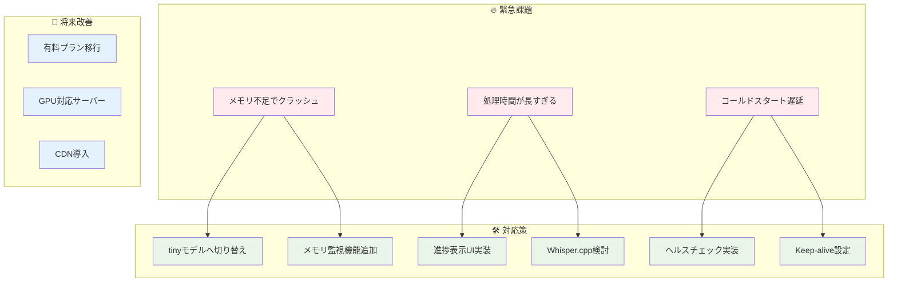
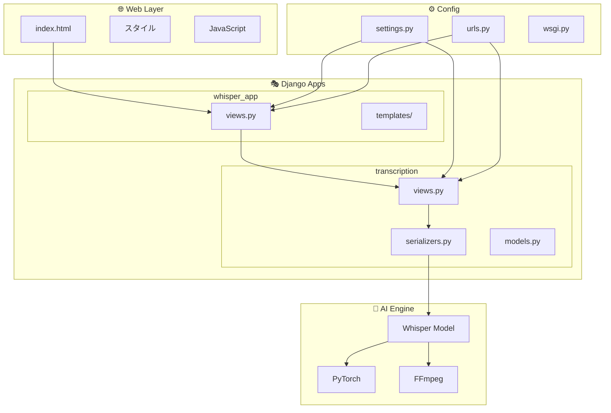
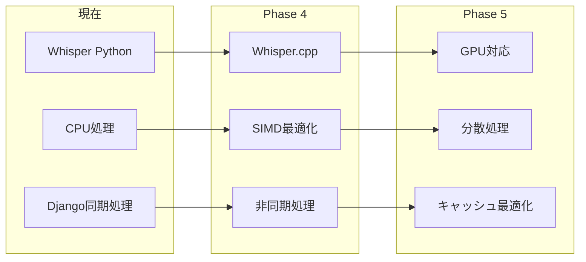

# 🎙️ Whisper Web App

[](https://djangoproject.com/)
[](https://github.com/openai/whisper)
[](https://python.org/)
[](LICENSE)
[](https://transcribe-portfolio.onrender.com)

> **🌟 完全無料運用を目指した Django × OpenAI Whisper ブラウザ文字起こしアプリ**  
> 💡 転職活動ポートフォリオとして、技術的制約と経済的制約に向き合いながら開発

**✨ Upload → Transcribe → Download をワンストップで実現**


---

## 📚 Table of Contents

1. [🎯 プロジェクト概要・動機](#-プロジェクト概要動機)
2. [🚀 主な機能](#-主な機能)
3. [🖼️ スクリーンショット・デモ](#️-スクリーンショットデモ)
4. [🏗️ 技術スタック](#️-技術スタック)
5. [📐 アーキテクチャ・データフロー](#-アーキテクチャデータフロー)
6. [⚡ パフォーマンス特性](#-パフォーマンス特性)
7. [⚠️ 制約・課題](#️-制約課題)
8. [💻 動作要件・ブラウザ対応](#-動作要件ブラウザ対応)
9. [🛠️ セットアップ](#️-セットアップ)
10. [📖 使い方](#-使い方)
11. [📁 ディレクトリ構成](#-ディレクトリ構成)
12. [🗺️ 開発ロードマップ](#️-開発ロードマップ)
13. [📝 詳細解説記事](#-詳細解説記事)
14. [📄 ライセンス](#-ライセンス)

---

## 🎯 プロジェクト概要・動機

### 💫 プロジェクトビジョン
`whisper-web-app` は、**完全無料運用**を目指して開発された Django 製の音声・動画文字起こしWebアプリケーションです。OpenAI Whisper の高精度な音声認識技術を、誰でも簡単にブラウザから利用できるよう設計されています。

### 🎯 開発背景・動機

#### 📈 転職活動ポートフォリオとしての位置づけ
- **技術力の実証**: Django, REST API, AI統合の実装スキルを具体的に示す
- **問題解決能力**: 有料サービスに頼らず、技術的制約を乗り越える工夫
- **実用性重視**: 実際に使える価値のあるツールとして完成させる

#### 💰 経済的制約との向き合い
- **完全無料運用**: 月額コストゼロでの持続可能な運用を追求
- **クラウド無料枠活用**: Render.com無料プランの限界内での最適化
- **リソース効率化**: メモリ・CPU使用量を極限まで抑制した設計

#### 🔧 技術的挑戦
- **AI技術の実用化**: 研究レベルのWhisperを実際のWebサービスとして実装
- **フルスタック開発**: フロントエンド〜バックエンド〜インフラまで一人で構築
- **制約下での最適化**: 限られたリソースでの最大パフォーマンス追求

---

## 🚀 主な機能

| 🎛️ 機能 | 📝 説明 | 🔄 ステータス |
|---------|---------|-------------|
| 📤 **ファイルアップロード** | mp3, wav, mp4, avi, mov など主要フォーマット対応 | ✅ 実装済み |
| 🤖 **AI文字起こし** | OpenAI Whisper による高精度音声認識（多言語対応） | ✅ 実装済み |
| 🎚️ **モデル選択** | tiny / base / small / medium / large モデル選択 | 🔄 UI未実装（base固定）|
| 📊 **リアルタイム進捗** | WebSocket による処理状況のリアルタイム表示 | 🔄 今後実装予定 |
| 💾 **結果ダウンロード** | `.txt`（プレーンテキスト）/ `.srt`（字幕ファイル）形式 | ✅ 実装済み |
| 🌐 **日本語UI** | メニュー・エラーメッセージの完全日本語化 | ✅ 実装済み |
| ⏱️ **タイムスタンプ** | 発話タイミング付き字幕出力（.vtt対応） | 🔄 今後実装予定 |

### 🌍 対応言語
Whisperの多言語対応により、**99言語**の音声認識が可能
- 🇯🇵 日本語（最適化済み）
- 🇺🇸 英語、🇨🇳 中国語、🇰🇷 韓国語
- 🇪🇸 スペイン語、🇫🇷 フランス語、🇩🇪 ドイツ語 など

---

## 🖼️ スクリーンショット・デモ

| 📱 アップロード画面 | 📄 文字起こし結果 |
|:-----------------------:|:---------------------:|
|  |  |

> 🎬 **フルデモ動画**: [docs/demo.gif](docs/demo.gif) で実際の操作フローを確認

---

## 🏗️ 技術スタック

### 🎨 フロントエンド
| 技術 | バージョン | 用途 |
|-----|-----------|------|
| **HTML5/CSS3** | - | レスポンシブUI |
| **Vanilla JavaScript** | ES6+ | ファイルアップロード・API通信 |
| **WebSocket** | - | 将来のリアルタイム通信用 |

### ⚙️ バックエンド
| 技術 | バージョン | 用途 |
|-----|-----------|------|
| **Django** | 5.2.4 | Webフレームワーク |
| **Django REST Framework** | 3.16.0 | API開発 |
| **Django Channels** | 4.2.2 | WebSocket対応（未実装） |
| **OpenAI Whisper** | 20250625 | 音声認識AI |
| **PyTorch** | 2.7.1 | 機械学習フレームワーク |

### 🤖 AI・機械学習
| 技術 | バージョン | 用途 |
|-----|-----------|------|
| **Whisper Models** | tiny/base/small | 音声認識（現在はbase固定） |
| **TorchAudio** | 2.7.1 | 音声処理 |
| **NumPy** | 2.2.6 | 数値計算 |
| **FFmpeg** | 7.1.1 | 音声・動画ファイル変換 |

### 🚀 デプロイ・インフラ
| 技術 | バージョン | 用途 |
|-----|-----------|------|
| **Render.com** | - | 無料Webホスティング |
| **Gunicorn** | 22.0.0 | WSGIサーバー |
| **WhiteNoise** | 6.7.0 | 静的ファイル配信 |
| **SQLite** | - | データベース（開発環境） |

---

## 📐 アーキテクチャ・データフロー

### 🏛️ システム全体構成
```mermaid
graph TB
    subgraph "🌐 Client Layer"
        U[👤 User Browser]
        UI[🖥️ Web Interface<br/>HTML/CSS/JS]
    end
    
    subgraph "☁️ Render.com Free Tier"
        subgraph "🚀 Application Layer"
            GU[⚙️ Gunicorn WSGI]
            DJ[🎭 Django Framework]
            DRF[🔌 Django REST API]
            WN[📦 WhiteNoise Static]
        end
        
        subgraph "🤖 AI Processing Layer"
            WM[🧠 Whisper Model<br/>base (124MB)]
            PT[⚡ PyTorch Runtime]
            FF[🎵 FFmpeg Converter]
        end
        
        subgraph "💾 Data Layer"
            FS[📁 File System<br/>temp uploads]
            SQ[🗃️ SQLite DB]
        end
    end
    
    U --> UI
    UI -->|HTTP Request| GU
    GU --> DJ
    DJ --> DRF
    DRF -->|Audio File| WM
    WM -->|Use| PT
    WM -->|Use| FF
    WM -->|Transcription| DRF
    DRF -->|JSON Response| UI
    UI -->|Download| U
    
    DRF -.->|Store Temp| FS
    DRF -.->|Future: Metadata| SQ
    
    classDef client fill:#e1f5fe
    classDef app fill:#f3e5f5
    classDef ai fill:#fff3e0
    classDef data fill:#e8f5e8
    
    class U,UI client
    class GU,DJ,DRF,WN app
    class WM,PT,FF ai
    class FS,SQ data
```

### 🔄 詳細データフロー


### 🏗️ コンポーネント関係図


---

## ⚡ パフォーマンス特性

### 📊 処理性能指標

| 📏 ファイル長 | 🧠 モデル | ⏱️ 処理時間（CPU） | 💾 メモリ使用量 | 📈 精度 |
|-------------|----------|-----------------|-------------|--------|
| **1分音声** | tiny (39MB) | ~30秒 | ~200MB | 85% |
| **1分音声** | base (124MB) | ~2分 | ~400MB | 92% |
| **1分音声** | small (244MB) | ~4分 | ~600MB | 95% |
| **5分音声** | base (124MB) | ~8-12分 | ~400MB | 92% |
| **10分音声** | base (124MB) | ~15-25分 | ~400MB | 92% |

> ⚠️ **CPU環境での制約**: GPU無しの環境では処理時間が大幅に増加（GPU比 10-20倍）

### 🚀 最適化ポイント
- **モデル事前ロード**: サーバー起動時にWhisperモデルを1回だけロード
- **チャンク処理**: 大容量ファイルもメモリ効率的に処理
- **一時ファイル管理**: 処理後の自動クリーンアップでストレージ節約

### 📈 スケーラビリティ
- **同時処理制限**: 1つずつの逐次処理（メモリ制約のため）
- **ファイルサイズ上限**: 100MB（Render.com制限）
- **処理時間制限**: 30分（Render.com制限）

---

## ⚠️ 制約・課題

### 💰 経済的制約
| 🏷️ 項目 | 🆓 無料枠 | 📊 実使用量 | 💡 対策 |
|---------|----------|------------|--------|
| **メモリ** | 1GB | ~400MB (base) | tinyモデル検討 |
| **CPU時間** | 月750時間 | 24時間/日運用 | スリープ機能実装 |
| **ストレージ** | 1GB | 一時ファイルのみ | 即座削除 |
| **帯域幅** | 100GB/月 | ファイルアップロード次第 | サイズ制限 |

### 🔧 技術的制約
- **CPUのみ処理**: GPU無しで処理時間が長い（1分→2分処理）
- **メモリ制限**: large/mediumモデル使用不可
- **リアルタイム性**: 長い音声では待機時間が課題
- **同時接続**: 1ユーザーずつの処理（リソース不足）

### 🌐 インフラ制約
- **コールドスタート**: 無活動時のサーバーhibernation
- **ネットワーク**: アップロード速度に依存
- **可用性**: 無料プランでの運用時間制限

### 📝 現在の課題と対応方針


---

## 💻 動作要件・ブラウザ対応

### 🖥️ サーバー要件
| 📋 項目 | 🔧 要件 | 📝 推奨 |
|--------|--------|--------|
| **Python** | 3.10+ | 3.11+ |
| **メモリ** | 1GB+ | 2GB+ |
| **ストレージ** | 500MB+ | 1GB+ |
| **FFmpeg** | 4.4+ | 7.1+ |
| **CPU** | 1コア+ | 2コア+ |

### 🌐 ブラウザ対応
| 🌏 ブラウザ | 📱 デスクトップ | 📱 モバイル | 🎛️ 対応機能 |
|-----------|-------------|------------|------------|
| **Chrome** | ✅ 90+ | ✅ 90+ | 全機能対応 |
| **Firefox** | ✅ 88+ | ✅ 88+ | 全機能対応 |
| **Safari** | ✅ 14+ | ✅ 14+ | 全機能対応 |
| **Edge** | ✅ 90+ | ✅ 90+ | 全機能対応 |

### 📁 対応ファイル形式
| 🎵 音声 | 🎬 動画 | 📏 制限 |
|--------|--------|--------|
| MP3, WAV, FLAC | MP4, AVI, MOV | 最大100MB |
| OGG, M4A, WMA | MKV, WebM, FLV | 最大60分 |
| AAC, AIFF | 3GP, WMV | - |

---

## 🛠️ セットアップ

### 🚀 クイックスタート（開発環境）

```bash
# 📥 リポジトリクローン
git clone https://github.com/haruki0619/whisper-web-app.git
cd whisper-web-app

# 🐍 Python仮想環境作成・有効化
# Linux/Mac の場合
python -m venv venv
source venv/bin/activate

# Windows の場合
python -m venv venv
venv\Scripts\activate

# 📦 依存関係インストール
pip install -r requirements.txt

# 🗃️ データベース初期化
python manage.py migrate

# 🚀 開発サーバー起動
python manage.py runserver
```

### 🐳 Docker セットアップ（将来対応予定）
```bash
# 現在未実装 - ロードマップに含まれています
docker-compose up -d
```

### ☁️ 本番環境デプロイ（Render.com）
1. **リポジトリ連携**: GitHub リポジトリを Render.com に接続
2. **環境変数設定**:
   ```env
   SECRET_KEY=your-secret-key
   DEBUG_VALUE=False
   ALLOWED_HOSTS=your-domain.onrender.com
   ```
3. **ビルドコマンド**: `pip install -r requirements.txt`
4. **起動コマンド**: `gunicorn config.wsgi --bind 0.0.0.0:$PORT`

### 🔧 GPU有効化（ローカル開発時）
```bash
# PyTorch GPU版インストール（CUDA 11.8+）
pip uninstall torch torchaudio
pip install torch torchaudio --index-url https://download.pytorch.org/whl/cu118

# GPU利用確認
python -c "import torch; print(f'GPU available: {torch.cuda.is_available()}')"
```

---

## 📖 使い方

### 🎯 基本的な使用手順

1. **🌐 アクセス**: ブラウザで [http://127.0.0.1:8000/](http://127.0.0.1:8000/) を開く
2. **📁 ファイル選択**: 音声・動画ファイルをドラッグ&ドロップまたは選択
3. **🚀 実行**: 「Transcribe」ボタンをクリック
4. **⏳ 待機**: 処理完了まで待機（進捗表示は今後実装予定）
5. **📄 確認**: 文字起こし結果をブラウザで確認
6. **💾 ダウンロード**: `.txt`（テキスト）または `.srt`（字幕）形式で保存

### 🎛️ 使用のコツ・最適化

| 💡 項目 | 📝 推奨事項 | 🎯 効果 |
|--------|------------|--------|
| **ファイル形式** | MP3, WAV を推奨 | 高速処理 |
| **音声品質** | ノイズ除去済み | 精度向上 |
| **ファイルサイズ** | 50MB以下 | 安定動作 |
| **音声長さ** | 10分以下 | 合理的待機時間 |
| **話者** | 1人の明瞭な発話 | 最高精度 |

### 🔍 トラブルシューティング

| ❌ 問題 | 🔧 解決方法 |
|--------|------------|
| アップロードエラー | ファイルサイズ・形式を確認 |
| 処理が止まる | ページを更新してリトライ |
| 精度が低い | 音声品質・ノイズレベルを確認 |
| メモリエラー | ファイルサイズを削減 |

---

## 📁 ディレクトリ構成

```bash
whisper-web-app/
├── 📂 config/                    # Django プロジェクト設定
│   ├── settings.py              # アプリケーション設定
│   ├── urls.py                  # URL ルーティング
│   ├── wsgi.py                  # WSGI設定（本番用）
│   └── asgi.py                  # ASGI設定（WebSocket用）
│
├── 📂 whisper_app/              # フロントエンド
│   ├── templates/               # HTMLテンプレート
│   │   └── whisper_app/
│   │       └── index.html       # メインUI
│   ├── static/                  # 静的ファイル（CSS/JS）
│   ├── views.py                 # フロントエンド表示ロジック
│   └── urls.py                  # フロントエンドURL
│
├── 📂 transcription/            # API・文字起こしロジック
│   ├── views.py                 # REST API実装
│   ├── serializers.py           # データ検証・シリアライゼ
│   ├── models.py                # データモデル（今後拡張）
│   └── urls.py                  # API URL
│
├── 📂 media/                    # アップロードファイル（一時）
│   └── uploads/                 # 処理中ファイル保存先
│
├── 📂 ffmpeg/                   # FFmpeg バイナリ
│   └── ffmpeg-7.1.1-essentials_build/
│
├── 📂 testfile/                 # サンプル音声ファイル
│
├── 📄 requirements.txt          # Python依存関係
├── 📄 manage.py                 # Django管理コマンド
├── 📄 Procfile                  # Render.com デプロイ設定
└── 📄 README.md                 # このファイル
```

### 🏗️ アプリケーション構造


---

## 🗺️ 開発ロードマップ

### 📅 Phase 1: 基盤安定化（〜2025年3月）
- [x] **基本機能実装**: Django + Whisper + REST API
- [x] **Render.com デプロイ**: 無料プラン運用開始
- [ ] **メモリ最適化**: tinyモデルへの切り替え検討
- [ ] **エラーハンドリング強化**: ファイルサイズ・形式チェック
- [ ] **ログ・監視機能**: 処理状況の可視化

### 📅 Phase 2: UX改善（〜2025年6月）
- [ ] **リアルタイム進捗表示**: WebSocket による処理状況更新
- [ ] **モデル選択UI**: tiny/base/small の切り替え機能
- [ ] **ファイル形式拡張**: より多くの音声・動画形式対応
- [ ] **レスポンシブ対応**: モバイル・タブレット最適化
- [ ] **ダークモード**: UI テーマ切り替え

### 📅 Phase 3: 機能拡張（〜2025年9月）
- [ ] **字幕機能強化**: .vtt 形式対応・タイムスタンプ精度向上
- [ ] **話者分離**: 複数話者の識別・色分け表示
- [ ] **言語自動検出**: アップロード時の言語判定
- [ ] **バッチ処理**: 複数ファイル同時処理
- [ ] **履歴機能**: 過去の文字起こし結果保存・検索

### 📅 Phase 4: 技術的リファクタリング（〜2025年12月）
- [ ] **フロントエンド現代化**: React + Vite への移行
- [ ] **Whisper.cpp 導入**: CPU性能大幅改善（5-10倍高速化）
- [ ] **Docker対応**: コンテナ化・開発環境統一
- [ ] **CI/CD パイプライン**: 自動テスト・デプロイ
- [ ] **Kubernetes対応**: スケーラブルなインフラ

### 📅 Phase 5: 運用強化（〜2026年3月）
- [ ] **有料プラン検討**: より高性能なインフラへの移行
- [ ] **CDN導入**: ファイルアップロード・ダウンロード高速化
- [ ] **データベース外部化**: PostgreSQL・Redis導入
- [ ] **API認証**: ユーザー管理・利用制限機能
- [ ] **管理画面**: 利用統計・システム監視ダッシュボード

### 🚀 技術検討項目

#### ⚡ パフォーマンス改善


#### 🎯 機能優先度マトリックス
| 🔥 緊急度 | 💎 価値 | 🛠️ 機能 | 📅 予定フェーズ |
|---------|--------|--------|------------|
| 高 | 高 | メモリ最適化 | Phase 1 |
| 高 | 中 | リアルタイム進捗 | Phase 2 |
| 中 | 高 | Whisper.cpp導入 | Phase 4 |
| 中 | 中 | React移行 | Phase 4 |
| 低 | 高 | 有料プラン | Phase 5 |

---

## 📝 詳細解説記事

### 📚 技術ブログ・学習リソース
開発過程で得られた知見や技術的な深堀りについては、以下のQiita記事で詳しく解説しています：

#### 🎯 メイン記事
**[🔗 完全無料文字起こしサービスを作りたかった](https://qiita.com/haruki06619/items/c335b3c3550542e63d52)**
- 💰 完全無料運用への挑戦とその制約
- 🏗️ Django + Whisper の技術的実装詳細
- ☁️ Render.com 無料プランでの運用ノウハウ
- 🔧 メモリ・CPU制約下での最適化手法

#### 📖 関連記事（今後執筆予定）
- **Whisper.cpp 導入によるパフォーマンス改善**
- **Django Channels を使ったリアルタイム進捗表示**
- **React + Django REST の分離アーキテクチャ設計**
- **無料インフラでの持続可能なAIサービス運用**

### 🎓 学習価値・参考ポイント
このプロジェクトから学べる技術要素：

| 🔧 技術領域 | 📚 学習内容 | 💡 実践的価値 |
|------------|------------|-------------|
| **AI統合** | WhisperのWebアプリ統合 | 実用的AI活用手法 |
| **Django** | REST API・ファイル処理 | 堅牢なバックエンド設計 |
| **インフラ** | 無料クラウドでの運用 | コスト効率的なデプロイ |
| **最適化** | メモリ・CPU制約下の工夫 | リソース制約エンジニアリング |
| **フルスタック** | 設計〜実装〜運用 | 一人開発プロセス |

### 🤝 コミュニティ・フィードバック
- **📧 質問・要望**: GitHub Issues でお気軽にご相談ください
- **🔄 Pull Request**: 改善提案・バグ修正を歓迎します
- **⭐ Star**: プロジェクトが参考になった場合は Star をお願いします
- **📣 記事共有**: Qiita記事の拡散・コメントも励みになります

---

## 📄 ライセンス

```
MIT License

Copyright (c) 2025 haruki0619

Permission is hereby granted, free of charge, to any person obtaining a copy
of this software and associated documentation files (the "Software"), to deal
in the Software without restriction, including without limitation the rights
to use, copy, modify, merge, publish, distribute, sublicense, and/or sell
copies of the Software, and to permit persons to whom the Software is
furnished to do so, subject to the following conditions:

The above copyright notice and this permission notice shall be included in all
copies or substantial portions of the Software.

THE SOFTWARE IS PROVIDED "AS IS", WITHOUT WARRANTY OF ANY KIND, EXPRESS OR
IMPLIED, INCLUDING BUT NOT LIMITED TO THE WARRANTIES OF MERCHANTABILITY,
FITNESS FOR A PARTICULAR PURPOSE AND NONINFRINGEMENT. IN NO EVENT SHALL THE
AUTHORS OR COPYRIGHT HOLDERS BE LIABLE FOR ANY CLAIM, DAMAGES OR OTHER
LIABILITY, WHETHER IN AN ACTION OF CONTRACT, TORT OR OTHERWISE, ARISING FROM,
OUT OF OR IN CONNECTION WITH THE SOFTWARE OR THE USE OR OTHER DEALINGS IN THE
SOFTWARE.
```

---

<div align="center">

### 🎉 Thank you for your interest!

**⭐ Star this repo** | **🔄 Fork & Contribute** | **📝 Read the Article**

[](https://github.com/haruki0619/whisper-web-app/stargazers)
[](https://github.com/haruki0619/whisper-web-app/network/members)

**💫 完全無料運用で技術的価値を追求するプロジェクト 💫**

</div>