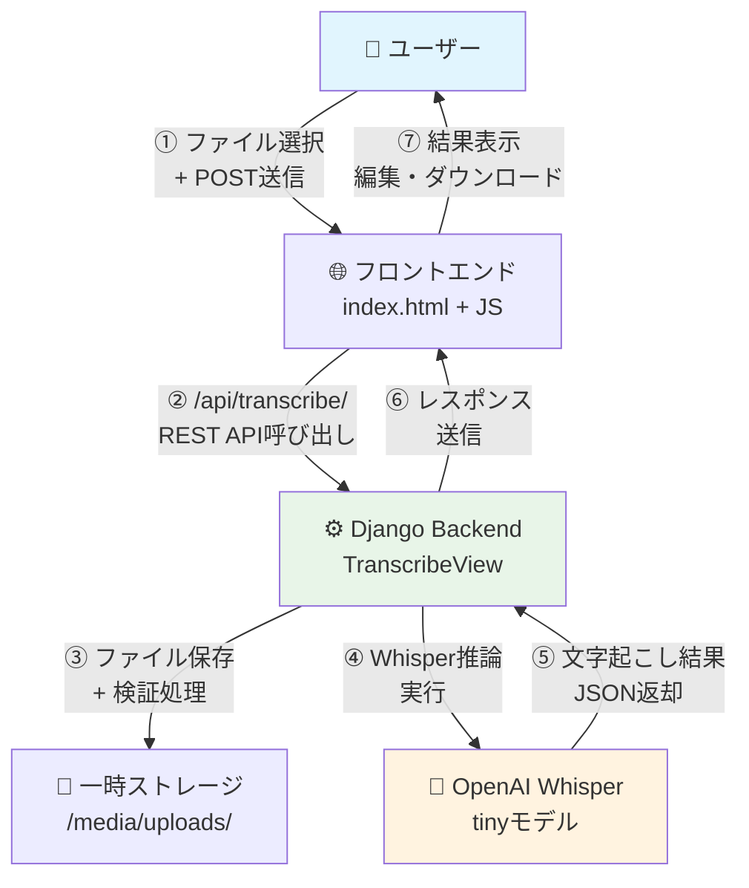

# 🎙️ Whisper Web App

> **Django × OpenAI Whisper** による高精度音声文字起こしWebアプリケーション  
> 「完全無料運用」を目指した個人開発プロジェクトの技術実証

[](https://python.org)
[](https://djangoproject.com)
[](https://github.com/openai/whisper)
[](LICENSE)


## 📖 Table of Contents

1. [概要](#-概要)
2. [背景・動機](#-背景動機)
3. [主な機能](#-主な機能)
4. [技術スタック](#-技術スタック)
5. [アーキテクチャ](#-アーキテクチャ)
6. [動作要件](#-動作要件)
7. [クイックスタート](#-クイックスタート)
8. [使い方](#-使い方)
9. [パフォーマンス特性](#-パフォーマンス特性)
10. [制約・課題](#-制約課題)
11. [ディレクトリ構成](#-ディレクトリ構成)
12. [開発ロードマップ](#-開発ロードマップ)
13. [関連記事](#-関連記事)
14. [ライセンス](#-ライセンス)

## 🎯 概要

**Whisper Web App** は、Webブラウザから音声・動画ファイルをアップロードするだけで  
**高精度な文字起こし**を実行するDjangoアプリケーションです。

- 🌐 **ブラウザベース**: インストール不要、URL一つでアクセス可能
- 🤖 **高精度AI**: OpenAI Whisperによる多言語対応音声認識
- 🚀 **シンプル設計**: 最小限の操作で文字起こし完了
- 📱 **レスポンシブ**: PC・スマートフォン両対応

## 💡 背景・動機

このプロジェクトは、**転職活動中のポートフォリオ**として開発されました。

### 当初の目標
- 「**完全無料で使える文字起こしサービス**」の提供
- 技術力アピールと実用性を両立したデモアプリの制作
- 個人開発におけるサービス運用ノウハウの習得

### 現実との向き合い
結果的に「完全無料運用」は技術的・経済的制約により断念しましたが、  
**個人開発の現実的な制約を学ぶ**貴重な体験となりました。

> 📝 詳細な開発記録は [Qiita記事](https://qiita.com/haruki06619/items/c335b3c3550542e63d52) で公開中

## ✨ 主な機能

| 機能 | 説明 | 実装状況 |
|------|------|----------|
| 🎵 **ファイルアップロード** | mp3, wav, mp4など主要音声・動画フォーマット対応 | ✅ 完了 |
| 🤖 **自動文字起こし** | Whisper tinyモデルによる高精度変換 | ✅ 完了 |
| ✏️ **結果編集** | ブラウザ上でテキスト編集可能 | ✅ 完了 |
| 💾 **ダウンロード** | `.txt`形式での結果保存 | ✅ 完了 |
| 📋 **コピー機能** | ワンクリックでクリップボードにコピー | ✅ 完了 |
| 🌍 **多言語対応** | 日本語・英語他、Whisper対応言語 | ✅ 完了 |
| ⚡ **進捗表示** | WebSocketによるリアルタイム進捗 | 🚧 開発中 |
| 🎚️ **モデル選択** | tiny/base/smallモデル切り替えUI | 🚧 開発中 |

## 🛠️ 技術スタック

| カテゴリ | 技術 | バージョン | 選定理由 |
|----------|------|------------|----------|
| **Backend** | Python | 3.11+ | 安定性・ライブラリ豊富 |
| **Web Framework** | Django | 5.2 | REST API開発効率性 |
| **AI Engine** | OpenAI Whisper | 20250625 | 高精度・多言語対応 |
| **Deep Learning** | PyTorch | 2.2+ | Whisper実行環境 |
| **Audio Processing** | FFmpeg | 6.x+ | 各種フォーマット対応 |
| **Frontend** | HTML/CSS/JS | Vanilla | 軽量・依存関係最小化 |

## 🏗️ アーキテクチャ



### データフロー詳細

1. **アップロード**: ユーザーがブラウザから音声ファイルを選択
2. **API送信**: JavaScriptがFormDataとしてDjango REST APIに送信
3. **バリデーション**: DRFシリアライザーでファイル形式・サイズを検証
4. **一時保存**: `/media/uploads/`に一時的にファイル保存
5. **Whisper実行**: グローバル変数のモデルインスタンスで文字起こし実行
6. **結果返却**: JSON形式でテキスト結果を返却
7. **UI更新**: フロントエンドで結果表示・編集・ダウンロード機能提供

## 💻 動作要件

| 項目 | 最小要件 | 推奨環境 |
|------|----------|----------|
| **Python** | 3.10+ | 3.11+ |
| **メモリ** | 2GB+ | 4GB+ (Whisper tiny: ~1GB) |
| **ストレージ** | 1GB+ | 2GB+ |
| **FFmpeg** | 4.4+ | 6.x+ |
| **CUDA** | - | 11.8+ (GPU使用時) |

### ブラウザ対応

| ブラウザ | バージョン | 対応状況 |
|----------|------------|----------|
| Chrome | 90+ | ✅ 完全対応 |
| Firefox | 88+ | ✅ 完全対応 |
| Safari | 14+ | ✅ 完全対応 |
| Edge | 90+ | ✅ 完全対応 |

## 🚀 クイックスタート

### 1. リポジトリクローン
```bash
git clone https://github.com/haruki0619/whisper-web-app.git
cd whisper-web-app
```

### 2. 仮想環境セットアップ
```bash
# Linux/Mac
python -m venv venv
source venv/bin/activate

# Windows
python -m venv venv
venv\Scripts\activate
```

### 3. 依存関係インストール
```bash
pip install -r requirements.txt
```

### 4. データベース初期化
```bash
python manage.py migrate
```

### 5. 開発サーバー起動
```bash
python manage.py runserver
```

### 6. ブラウザでアクセス
http://127.0.0.1:8000/

> 💡 **GPU環境の場合**: PyTorchのCUDA対応版を別途インストールしてください  
> ```bash
> pip install torch torchvision torchaudio --index-url https://download.pytorch.org/whl/cu118
> ```

## 📱 使い方

### ステップ1: ファイル選択


- 「ファイルを選択」ボタンクリック
- 音声ファイル (mp3, wav, m4a) または動画ファイル (mp4, avi, mov) を選択

### ステップ2: 文字起こし実行
- 「文字起こし」ボタンをクリック
- 処理中は進捗表示（実装予定）

### ステップ3: 結果確認・編集


- 文字起こし結果がテキストエリアに表示
- 必要に応じてブラウザ上で直接編集可能

### ステップ4: 保存・コピー
- 「テキストをコピー」: クリップボードに結果をコピー
- 「テキストファイルで保存」: `.txt`ファイルとしてダウンロード

## ⚡ パフォーマンス特性

### 処理時間（目安）

| 環境 | モデル | 音声1分あたりの処理時間 |
|------|--------|------------------------|
| **CPU** (Intel i5) | tiny | 8-12分 |
| **CPU** (Intel i7) | tiny | 5-8分 |
| **GPU** (RTX 3060) | tiny | 10-30秒 |
| **GPU** (RTX 4090) | tiny | 5-15秒 |

### メモリ使用量

| モデル | GPU VRAM | システムRAM |
|--------|----------|-------------|
| **tiny** | ~1GB | ~1GB |
| **base** | ~1GB | ~1GB |
| **small** | ~2GB | ~2GB |

## ⚠️ 制約・課題

### 技術的制約
- **メモリ要件**: Whisper tinyでも最低1GB必要
- **処理速度**: CPU環境では実用的でない処理時間
- **ファイルサイズ**: 大容量ファイル（100MB+）は処理時間が長時間

### 運用面の課題
- **クラウド無料枠**: メモリ制約により大手無料サービスでは動作困難
- **コスト構造**: GPU環境が必要なため、個人運用での採算性に課題
- **スケーラビリティ**: 同時接続数増加時のリソース不足

> 📊 詳細なコスト分析は [解説記事](https://qiita.com/haruki06619/items/c335b3c3550542e63d52) をご参照ください

## 📁 ディレクトリ構成

```
whisper-web-app/
├── 📁 config/                 # Django設定
│   ├── settings.py            # メイン設定ファイル
│   ├── urls.py               # URLルーティング
│   └── wsgi.py               # WSGI設定
├── 📁 whisper_app/           # フロントエンドアプリ
│   ├── 📁 templates/         # HTMLテンプレート
│   ├── views.py              # ビュー関数
│   └── urls.py               # URL設定
├── 📁 transcription/         # 文字起こしAPI
│   ├── views.py              # REST APIビュー
│   ├── serializers.py        # DRFシリアライザー
│   └── urls.py               # API URL設定
├── 📁 media/                 # アップロードファイル（一時）
│   └── 📁 uploads/           # 音声ファイル一時保存
├── 📁 docs/                  # ドキュメント・画像
│   ├── demo.gif              # デモ動画
│   ├── upload.png            # スクリーンショット
│   └── result.png            # スクリーンショット
├── requirements.txt          # Python依存関係
├── manage.py                # Django管理コマンド
└── README.md                # このファイル
```

## 🗺️ 開発ロードマップ

### Phase 1: 基本機能強化
- [ ] **進捗表示**: WebSocketによるリアルタイム進捗バー
- [ ] **モデル選択**: tiny/base/smallの切り替えUI
- [ ] **字幕出力**: .srt, .vtt形式での保存機能

### Phase 2: パフォーマンス最適化
- [ ] **Whisper.cpp統合**: CPU処理の高速化
- [ ] **非同期処理**: Celery + Redisによるバックグラウンド処理
- [ ] **キャッシュ機能**: 同一ファイルの重複処理回避

### Phase 3: フロントエンド強化
- [ ] **React化**: モダンフロントエンドスタックへの移行
- [ ] **PWA対応**: オフライン機能・プッシュ通知
- [ ] **ドラッグ&ドロップ**: ファイル選択UIの改善

### Phase 4: インフラ・運用
- [ ] **Docker対応**: コンテナ化による環境構築簡素化
- [ ] **Kubernetes**: スケーラブルなデプロイメント
- [ ] **CI/CD**: GitHub Actionsによる自動テスト・デプロイ

## 📚 関連記事

- 📝 **[Qiita: 完全無料文字起こしサービスを作りたかった](https://qiita.com/haruki06619/items/c335b3c3550542e63d52)**  
  開発プロセス、技術的課題、コスト分析の詳細記録

- 🔗 **[OpenAI Whisper 公式リポジトリ](https://github.com/openai/whisper)**  
  音声認識モデルの詳細情報

- 🔗 **[Django REST Framework](https://www.django-rest-framework.org/)**  
  REST API構築フレームワーク

## 📄 ライセンス

```
MIT License

Copyright (c) 2025 haruki0619

Permission is hereby granted, free of charge, to any person obtaining a copy
of this software and associated documentation files (the "Software"), to deal
in the Software without restriction, including without limitation the rights
to use, copy, modify, merge, publish, distribute, sublicense, and/or sell
copies of the Software, and to permit persons to whom the Software is
furnished to do so, subject to the following conditions:

The above copyright notice and this permission notice shall be included in all
copies or substantial portions of the Software.

THE SOFTWARE IS PROVIDED "AS IS", WITHOUT WARRANTY OF ANY KIND, EXPRESS OR
IMPLIED, INCLUDING BUT NOT LIMITED TO THE WARRANTIES OF MERCHANTABILITY,
FITNESS FOR A PARTICULAR PURPOSE AND NONINFRINGEMENT. IN NO EVENT SHALL THE
AUTHORS OR COPYRIGHT HOLDERS BE LIABLE FOR ANY CLAIM, DAMAGES OR OTHER
LIABILITY, WHETHER IN AN ACTION OF CONTRACT, TORT OR OTHERWISE, ARISING FROM,
OUT OF OR IN CONNECTION WITH THE SOFTWARE OR THE USE OR OTHER DEALINGS IN THE
SOFTWARE.
```

---

<div align="center">

**⭐ このプロジェクトが役に立った場合は、スターをお願いします！**

[🐛 Issue報告](https://github.com/haruki0619/whisper-web-app/issues) | 
[💡 機能提案](https://github.com/haruki0619/whisper-web-app/issues) | 
[🤝 プルリクエスト](https://github.com/haruki0619/whisper-web-app/pulls)

</div>